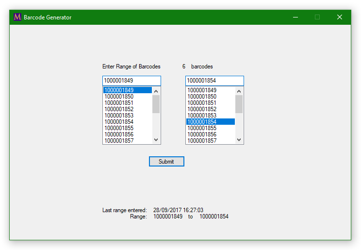

# Windows Forms App Multiple Barcode Generator

	
	

A simple multiple barcode generator for James Madison University [EFEX](http://www.jmu.edu/coe/efex/)'s lending library

### Using:
- [__PDFsharp__](http://www.pdfsharp.net/NuGetPackage_PDFsharp-GDI.ashx) to generate the printable PDFs
- [__UPC-A barcode font__](http://www.fontpalace.com/font-download/UPC-A/) to create the barcodes (for now at least)

<a href="http://educ.jmu.edu/~gilliabb/Inbox/BarcodeGeneratorSetup.msi"></img></a>

